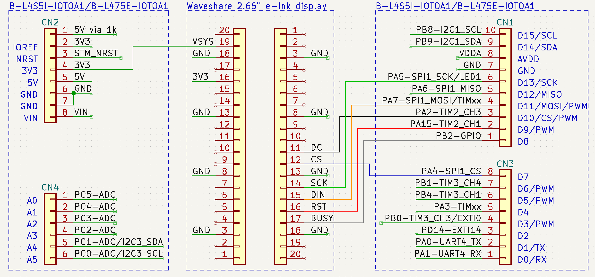

# Microsoft Azure IoT demo with STMicroelectronics B-L4S5I-IOTOA1 board and e-Ink display

> This demo has been derived from Microsoft **Azure RTOS** example available [here](https://github.com/azure-rtos/getting-started/tree/master/STMicroelectronics/B-L4S5I-IOT01A) and extended to support e-Ink display.  
> Please refer to the original source code location for prerequisites, environment setup, build and deployment instructions.

1. This repo uses submodules, to clone execute:    
`git clone --recursive https://github.com/tdjastrzebski/B-L4S5I-IOT01A_AZURE-RTOS`  
1. Copy `/app/azure_config-template.h` to `/app/azure_config.h`, provide settings like WiFi password, IoT hostname etc.
## What you need

* Visual Studio or VS Code with C/C++ tools
* [ST B-L4S5I-IOT01A board](https://www.st.com/en/evaluation-tools/b-l4s5i-iot01a.html)
* [2.66" Waveshare e-Ink Display](https://www.waveshare.com/wiki/Pico-ePaper-2.66) (optional)

## Visual Studio 2022 complete environment setup
From **PowerShell** run:  
* `git clone --recursive https://github.com/tdjastrzebski/B-L4S5I-IOT01A_AZURE-RTOS`
* `cd .\B-L4S5I-IOT01A_AZURE-RTOS`
* `iex (iwr -useb https://aka.ms/vcpkg-init.ps1)`  
* `vcpkg activate`
* `Start-Process devenv .`  

More info: [Embedded Software Development in Visual Studio](https://devblogs.microsoft.com/cppblog/visual-studio-embedded-development) by Marc Goodner
> Note: Visual Studio **Preview** version is no longer required.
# References
### 2.66" Waveshare eInk Display
* [Waveshare user guide](https://www.waveshare.com/wiki/2.66inch_e-Paper_Module_Manual#User_Guides_of_STM32)
* [Waveshare specification](https://www.waveshare.com/w/upload/d/dc/2.66inch-e-paper-specification.pdf)
* [demo code](https://github.com/waveshare/e-Paper)
* [SSD1680Z e-Paper controller](https://www.crystalfontz.com/controllers/SolomonSystech/SSD1680)
* [ST e-Paper driver](https://github.com/STMicroelectronics/STM32CubeL0/blob/a7b74aed35ecb7baeadeb16107aa8fddb6823589/Drivers/BSP/Components/gde021a1/gde021a1.c)

### LVGL TTF Font Converter
* https://github.com/lvgl/lv_font_conv (font converter as npm package!)
* https://lvgl.io/tools/fontconverter (online font converter)
* install: `npm i lv_font_conv -g`
* run: `lv_font_conv --font ./liberation-mono.regular.ttf --symbols ° --range 0x20-0x7F --size 20 --format lvgl --bpp 1 --no-compress -o ./app/liberation_mono_20.c`

### Free TTF fonts
* https://github.com/liberationfonts/liberation-fonts (Liberation Mono)
* https://www.1001fonts.com/liberation-mono-font.html
* https://github.com/fcambus/spleen
* https://www.freetype.org/ + https://gitlab.freedesktop.org/freetype
* http://www.angelcode.com/products/bmfont
* https://sourceforge.net/projects/terminus-font (Terminus font)
## e-Ink wiring diagram
> Note: e-Ink display is optional

